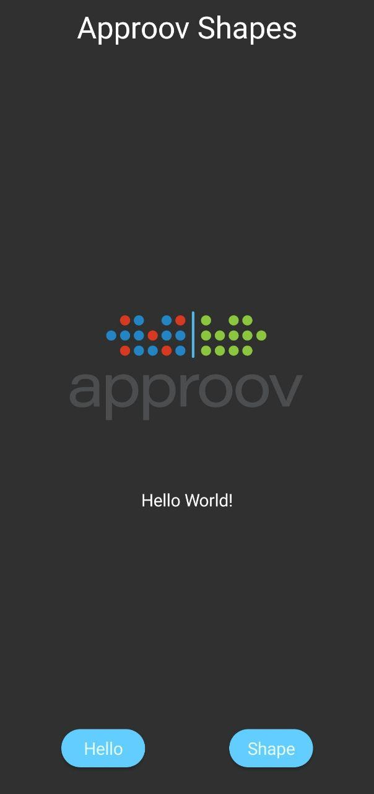
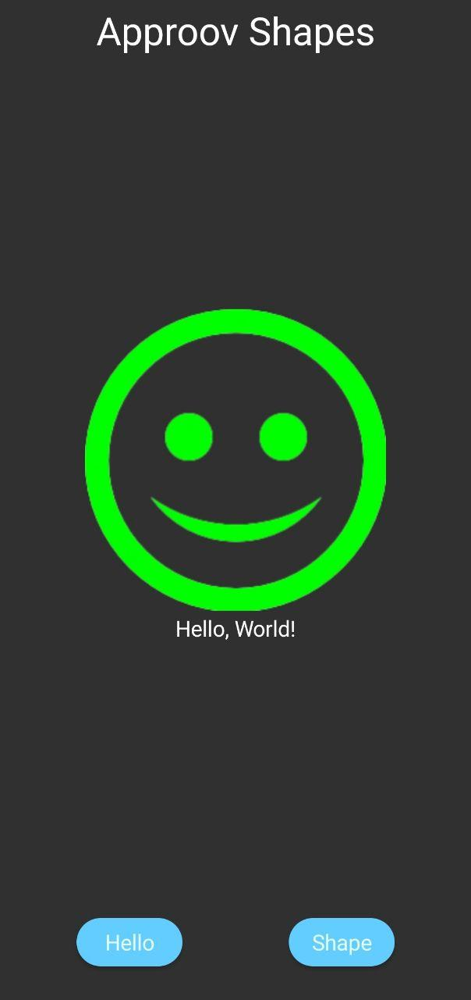
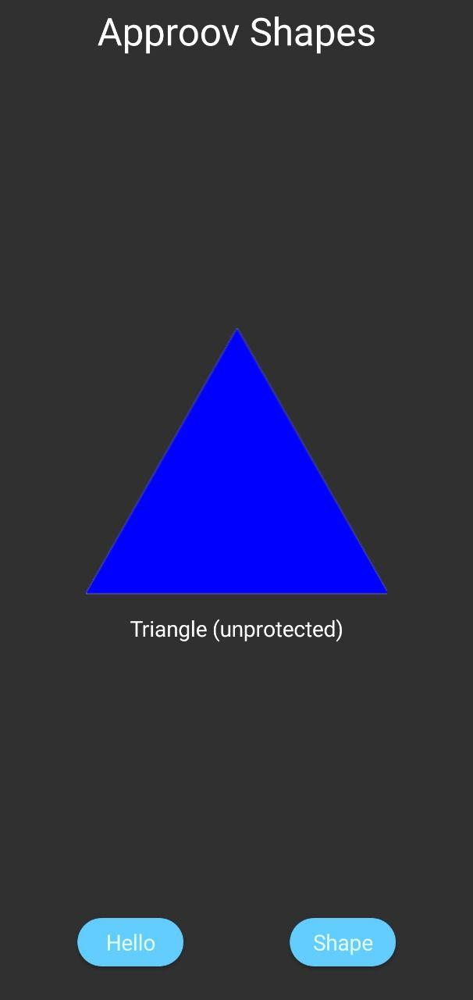
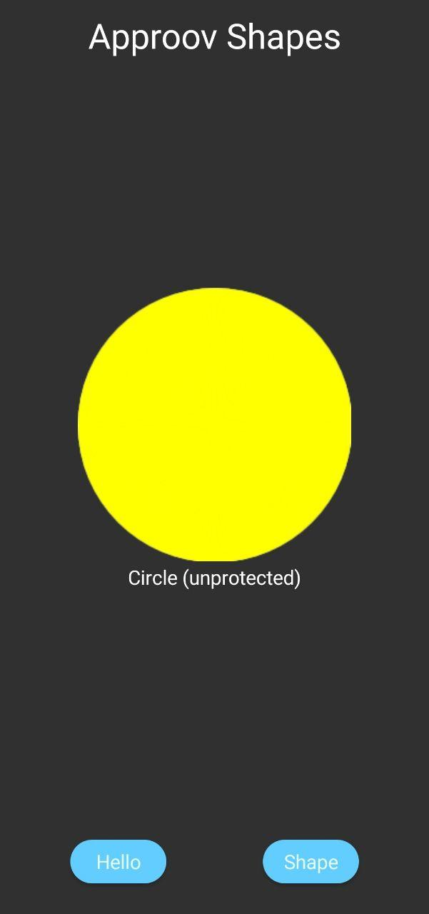
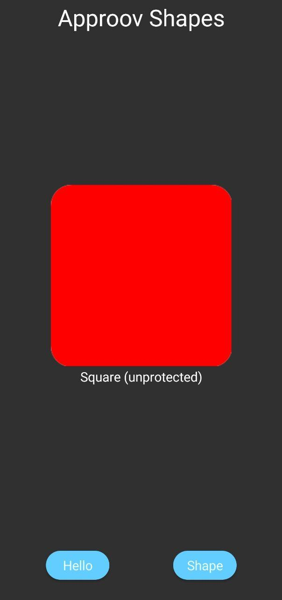
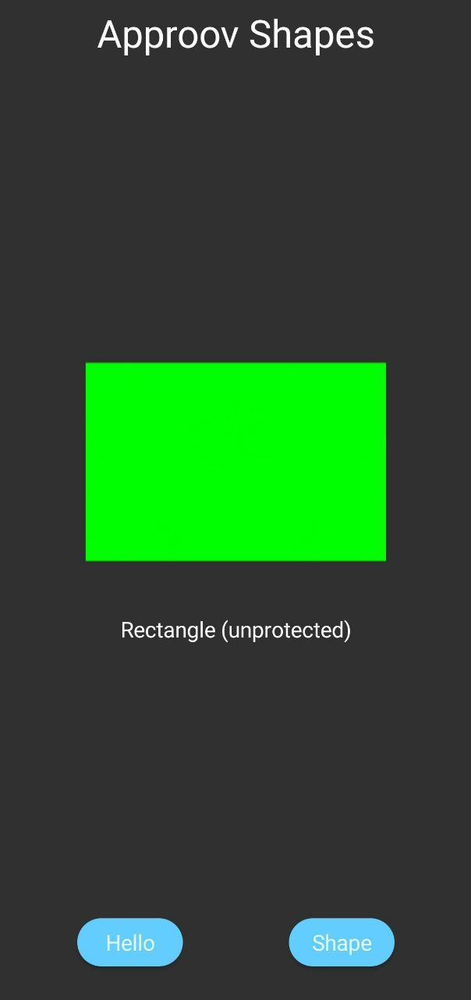
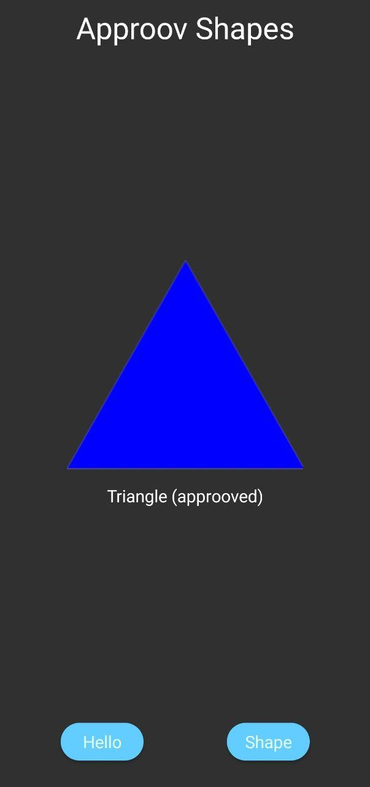

# Approov Quickstart: NativeScript (TS, Angular, Vue)

This quickstart is written specifically for native Android and iOS apps that are written
using [`NativeScript`](https://docs.nativescript.org/). If this is not your situation then check if there is a more
relevant Quickstart guide available.

## WHAT YOU WILL NEED

* This branch is tested with NodeJS version 14. So please make sure you are using Node v14 before proceeding.
* Access to a trial or paid Approov account
* The `approov` command line tool [installed](https://approov.io/docs/latest/approov-installation/) with access to your account
* The contents of the folder containing this README
* [`Xcode`](https://developer.apple.com/xcode/) if you would like to build the iOS samples (version 12.3 used in this guide) and a real iOS device since the Approov SDK allows using a simulator but will ONLY authenticate a real iOS device
* [`NativeScript`](https://docs.nativescript.org/) either version 6 or 7 (6.7.6 and 7.2.0 used in this guide)
* [`Android Studio`](https://developer.android.com/studio) if you would like to follow the Android examples (version 4.1.2 used)

## WHAT YOU WILL LEARN

* How to integrate Approov into a real app in a step by step fashion
* How to register your app to get valid tokens from Approov
* A solid understanding of how to integrate Approov into your own app that
  uses [`NativeScript`](https://docs.nativescript.org/)
* Some pointers to other Approov features

## STRUCTURE AND VERSION SUPPORT

This repository contains both the source code for plugin published to `npm` (in `src`) and also the some examples in `demo` (TypeScript-NativeScript version), `demo-angular` and `demo-vue`. These demos do not initially use Approov, and the intructions here show you how to add in the Approov plugin from `npm` to use Approov. You can then follow the same procedure for your own apps.

There are actually two different versions of the plugin depending on whether you are using the v7 or v6 version of NativeScript. The plugin source code is held in the banch `ns-v6` of this repo.

| NS Version | ns-approov-sdk version | Install command | Docs |
| ---        | ---                       | ---             | --- |
| ^7 | ^7 | ns plugin add @approov/ns-approov-sdk@^7 | [Here](https://github.com/approov/quickstart-nativescript/blob/main/QUICKSTART-README.md) |
| ^6 | ^6 | tns plugin add @approov/ns-approov-sdk@^6 | [Here](https://github.com/approov/quickstart-nativescript/blob/ns-v6/QUICKSTART-README.md) |

## RUNNING THE SHAPES APP WITHOUT APPROOV

The Shapes App is a simple NativeScript application written in Javascript using the Angular, VueJS and
TypeScript-NativeScript.

<p>
    
</p>

The application consists mostly of boilerplate code, apart from the definitions of the shapes server’s URLs and setting
up of the `onPress` callback for each of the buttons along the bottom of the screen.

The _Hello_ and _Shape_ buttons set up API requests to the shapes server, using the application’s
built-in [HTTP Module](https://docs.nativescript.org/ns-framework-modules/http). For example, the _Hello_ button
initiates a `GET` request to the `shapes.approov.io/v1/hello` endpoint.

On a successful _hello_ request to `/v1/hello`, the client app will say hello with a smile, while a failure or
unsuccessful response will return a frown with some explanation of the error. The purpose of this simple endpoint is
really just to test connectivity and to verify that you have built, installed and run the demo app correctly.

<a>
    
</a>

A successful _shapes_ request to `/v1/shapes` returns one of four possible shapes:

<a>
    
</a>

<a>
    
</a>

<a>
    
</a>

<a>
    
</a>

To build the NativeScript Shapes app, first ensure that you have the `npm` package manager installed for your system (
see the instructions for your specific OS [here](https://nodejs.org/en/)). Also make sure your system is set up for
NativeScript development by following their [Setup](https://docs.nativescript.org/start/quick-setup#full-setup)
instructions.

<mark>
Please make sure you are using Node v14 and not v15 because v15 has issue in NativeScript as it does not properly
  copies hooks that are required by the plugin.
</mark>

Open a shell terminal at `quickstart-nativescript/src` and type:

``` bash
npm i // or npm install
```

Then, set up the demo to run, First navigate to the directory (`demo-angular` / `demo-vue` / `demo`)

``` bash
npm i
```

This will install all the necessary packages and add the hooks to automatically add the approov-sdk in application.

Then, to run on an Android Emulator (which must already be launched), open another terminal window and type:

``` bash
cd quickstart-nativescript/(`demo-angular` or `demo-vue` or `demo`)
tns run android
``` 

Or if you are in a Mac, before attempting to run on an iOS device please check the codesigning identity you will use when deploying application and take a note of the desired [`TeamId`](https://support.customchurchapps.com/hc/en-us/articles/360038612853-Locating-your-Apple-Team-ID). Once you have found out the 10 digit `TeamID` you can either edit the `xcconfig` template for the project and replace the existing one with yours or use the command line option `--teamId`. If you choose to edit the file `quickstart-nativescript/(demo-angular or demo-vue or demo)/app/App_Resources/iOS/build.xcconfig` and modify the line `DEVELOPMENT_TEAM = XXXXXXXXXX` with the desired TeamID the change will remain valid regardless of how many times you rebuild the demo app.

 Now build and run the iOS app by entering the following command:

``` bash
cd quickstart-nativescript/(`demo-angular` or `demo-vue` or `demo`)
tns run ios
    # or if you would like to provide TeamID on command line
tns run ios --teamId XXXXXXXXXX (This is your 10 character Team ID)
```

Now grab a shape and enjoy the endless family fun!

## ADDING APPROOV SUPPORT

### Prerequisites

Before proceeding further make sure you have `approov` CLI installed otherwise the application will fail to build.

### Require the Approov NativeScript Package

Navigate to any of the three demo applications and run:

``` bash
tns plugin add @approov/ns-approov-sdk@^7
```

This will automatically install the plugin and add the necessary hooks to the application. Next you will need to generate the iOS or Android projects, download the Approov SDK and the [configuration file](https://approov.io/docs/latest/approov-usage-documentation/#sdk-configuration) required to initialize the SDK. To achieve so you need to execute a single command:

``` bash
cd quickstart-nativescript/(`demo-angular` or `demo-vue` or `demo`)
# If targetting iOS
tns prepare ios
# If targetting Android
tns prepare android
```

NOTE: Make sure Approov CLI is set up properly.

### Enable Approov Support in the App

You will need to update the following file based on the demo you are running:

``` ts
// For demo update `quickstart-nativescript/demo/app/main-page.ts`

/* Uncomment for Approov */

---------------------------------------------------------
// For Angular demo update `quickstart-nativescript/demo-angular/src/app/app.module.ts`

/* Uncomment for Approov */

---------------------------------------------------------
// For VueJS demo update `ns-aproov-sdk/demo-vue/src/main.ts`

/* Uncomment for Approov */
```

In order to enable Approov support in the Shapes app, the above mentioned block of code must be uncommented. Specifically, the code
imports a version of HTTP module with Approov support which can be used for making API calls in the app.

Approov also permits specifying the name of an existing HTTP header whose value will be bound to an Approov token for
additional protection. In this example, we bind the user’s Authorization Bearer token to the Approov token so that the
issued Approov token is only valid for a particular user. This effectively combines both app _and_ user authentication
for rock solid API protection!

``` ts
/* Uncomment for Approov */
import { NSApproov } from '@approov/ns-approov-sdk';

NSApproov.setApproovHeader('shapes.approov.io', { token: 'Approov-Token', binding: 'Authorization' });

// demo-angular/src/app/app.module.ts (Angular)
// demo-vue/src/main.ts               (VueJS)
// demo/app/main-page.ts              (Plain TypeScript)
```

### Select the Correct Shapes Endpoint

The Shapes server provides the app with shapes using multiple versions of an API: version
1 (https://shapes.approov.io/v1/shapes) which is _not_ protected by Approov, and version
2 (https://shapes.approov.io/v2/shapes) which _is_ protected by Approov.

Now that we’re using Approov, let’s switch to use version 2 of the Shapes API.

``` ts
  // demo-angular/src/app/app.component.ts
  readonly VERSION = 'v1'; // Change To v2 when using Approov
  
  // demo-vue/src/components/App.vue
  const VERSION = 'v1'; // use v2 for Approov
  
  // demo/app/main-page.ts
  const VERSION = 'v1';
```

`VERSION = 'v1';`

and change it to

`VERSION = 'v2';`

### Ensure the Shapes API is added

In order for Approov tokens to be generated for `https://shapes.approov.io/v2/shapes` it is necessary to inform Approov
about it. If you are using a demo account this is unnecessary as it is already setup. For a trial account do:

``` bash
approov api -add shapes.approov.io
```

Tokens for this domain will be automatically signed with the specific secret for this domain, rather than the normal one
for your account.

## REGISTER YOUR APP WITH APPROOV

In order for the Approov SDK authentication to work you will have to register it with the remote service using the `appproov` command line tools.

Warning: Never log tokens in a released app as this could permit hackers to harvest data from your API while the token
has not expired! Always
use _[loggable](https://www.approov.io/docs/latest/approov-usage-documentation/#loggable-tokens)_ Approov tokens for
debugging.

Regardless if you are building a release / debug build using `tns build <ios | android>` or if you are running the application using NativeScript CLI `tns run <ios | android>` you have to register it manually
using:

``` bash
    // Android
    approov registration -add demo-vue/platforms/android/app/build/outputs/apk/<debug|release>/app-<debug|release>.apk
    approov registration -add demo/platforms/android/app/build/outputs/apk/<debug|release>/app-<debug|release>.apk
    approov registration -add demo-angular/platforms/android/app/build/outputs/apk/<debug|release>/app-<debug|release>.apk
    
    // IOS
    approov registration -add demo-vue/platforms/ios/build/Debug-iphonesimulator/demo-vue.ipa
    approov registration -add demo/platforms/ios/build/Debug-iphonesimulator/demo.ipa
    approov registration -add demo-angular/platforms/ios/build/Debug-iphonesimulator/demo-angular.ipa
    
    The application / IPA is only registered in the first build. Subsequent build will not be registered automatically. 
```

Although the application is now receiving and forwarding tokens with your API calls, the tokens are not yet properly
signed, because the attestation service does not recognize your application. Once you register the app with the Approov
service, untempered apps will attest successfully and begin to fetch and transmit valid tokens.

## RUNNING THE SHAPES APP WITH APPROOV

Wait for the registration to propagate to the Approov service. This could take up to 30 seconds. Then restart your
application to flush out any bad tokens, tap _Get Shape_ and you should see:

<p>
    
</p>

or any of the four possible shapes returned by the server. Congratulations, your API is now Approoved!

## WHAT IF I DON'T GET SHAPES

* Sometime HMR does not work well in NativeScript or CLI does not properly register the application.
  For debugging purpose you can disable the hmr and run the app again.

``` bash
tns run ios --no-hmr
         or
tns run android --no-hmr
```

If you still don't get a valid shape then there are some things you can try. Remember this may be because the device you
are using has some characteristics that cause rejection for the currently
set [Security Policy](https://approov.io/docs/latest/approov-usage-documentation/#security-policies) on your account:

* Ensure that the version of the app you are running is exactly the one you registered with Approov.
* If you running the app from a debugger then valid tokens are not issued.
* Approov token data is logged to the console using a secure mechanism - that is, a _loggable_ version of the token is
  logged, rather than the _actual_ token for debug purposes. This is
  covered [here](https://www.approov.io/docs/latest/approov-usage-documentation/#loggable-tokens). The code which
  performs this is:

```
const result = await Approov.fetchApproovToken(url);
console.log("Fetched Approov token: " + result.loggableToken);
```

and the logged token is specified in the variable `result.loggableToken`.

The Approov token format (
discussed [here](https://www.approov.io/docs/latest/approov-usage-documentation/#token-format)) includes an `anno` claim
which can tell you why a particular Approov token is invalid, and your app is not correctly authenticated with the
Approov Cloud Service. The various forms of annotations are
described [here](https://www.approov.io/docs/latest/approov-usage-documentation/#annotation-results).

If you have a trial (as opposed to demo) account you have some additional options:

* Consider using an [Annotation Policy](https://approov.io/docs/latest/approov-usage-documentation/#annotation-policies)
  during development to directly see why the device is not being issued with a valid token.
* Use `approov metrics` to see [Live Metrics](https://approov.io/docs/latest/approov-usage-documentation/#live-metrics)
  of the cause of failure.
* You can use a debugger and get valid Approov tokens on a specific device
  by [whitelisting](https://approov.io/docs/latest/approov-usage-documentation/#adding-a-device-security-policy).

## NEXT STEPS

This quick start guide has shown you how to integrate Approov with your existing app. Now you might want to explore some
other Approov features:

* Managing your app [registrations](https://approov.io/docs/latest/approov-usage-documentation/#managing-registrations)
* Manage the [pins](https://approov.io/docs/latest/approov-usage-documentation/#public-key-pinning-configuration) on the
  API domains to ensure that no Man-in-the-Middle attacks on your app's communication are possible.
* Update your [Security Policy](https://approov.io/docs/latest/approov-usage-documentation/#security-policies) that
  determines the conditions under which an app will be given a valid Approov token.
* Learn how to [Manage Devices](https://approov.io/docs/latest/approov-usage-documentation/#managing-devices) that
  allows you to change the policies on specific devices.
* Understand how to provide access for other [Users](https://approov.io/docs/latest/approov-usage-documentation/#user-management) 
  of your Approov account.
* Use the [Metrics Graphs](https://approov.io/docs/latest/approov-usage-documentation/#metrics-graphs) to see live and
  accumulated metrics of devices using your account and any reasons for devices being rejected and not being provided
  with valid Approov tokens. You can also see your billing usage which is based on the total number of unique devices
  using your account each month.
* Use [Service Monitoring](https://approov.io/docs/latest/approov-usage-documentation/#service-monitoring) emails to
  receive monthly (or, optionally, daily) summaries of your Approov usage.
* Learn about [automated approov CLI usage](https://approov.io/docs/latest/approov-usage-documentation/#automated-approov-cli-usage).
* Investigate other advanced features, such
  as [Offline Security Mode](https://approov.io/docs/latest/approov-usage-documentation/#offline-security-mode),
  [DeviceCheck Integration](https://approov.io/docs/latest/approov-usage-documentation/#apple-devicecheck-integration),
  [SafetyNet Integration](https://approov.io/docs/latest/approov-usage-documentation/#google-safetynet-integration),
  and [Android Automated Launch Detection](https://approov.io/docs/latest/approov-usage-documentation/#android-automated-launch-detection)
  .


## TROUBLESHOOTING

> Android NDK

``` bash
"Execution failed for task ':app:stripDebugDebugSymbols'.
No version of NDK matched the requested version 20.0.5594570. Versions available locally: 21.3.6528147"
```

If you face this error please install the required version of NDK using ANDROID STUDIO.
For more info please follow this [link](https://developer.android.com/studio/projects/install-ndk).

> WEBPACK Failure
``` bash
executing 'tns plugin build'
Searching for devices...
Preparing project...
internal/modules/cjs/loader.js:883
  throw err;
  ^

Error: Cannot find module '/Users/userName/github/approov/quickstart-nativescript/demo-angular/node_modules/webpack/bin/webpack.js'
    at Function.Module._resolveFilename (internal/modules/cjs/loader.js:880:15)
    at Function.Module._load (internal/modules/cjs/loader.js:725:27)
    at Function.executeUserEntryPoint [as runMain] (internal/modules/run_main.js:72:12)
    at internal/main/run_main_module.js:17:47 {
  code: 'MODULE_NOT_FOUND',
  requireStack: []
}
```

This is mostly due to old webpack config or missing required dependencies.
Please execute the below mentioned commands in order:

``` bash
cd ../demo-angular // Considering you are in src directory
rm -rf platforms hooks node_modules package-lock.json webpack.config.js
npm i
npm i --save-dev nativescript-dev-webpack@next
./node_modules/.bin/update-ns-webpack --configs
```

You can then run `tns run ios --no-hmr --device` directly inside the demo you are in.
