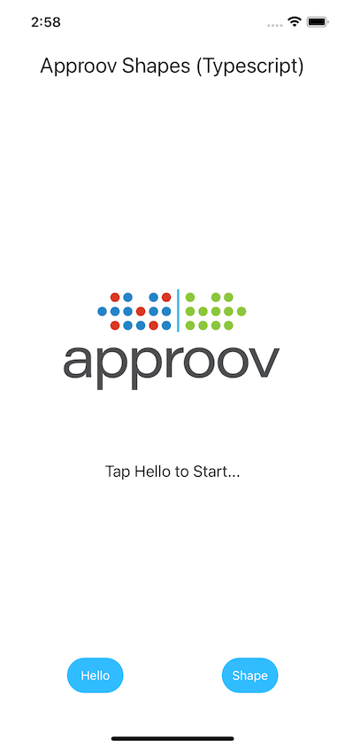
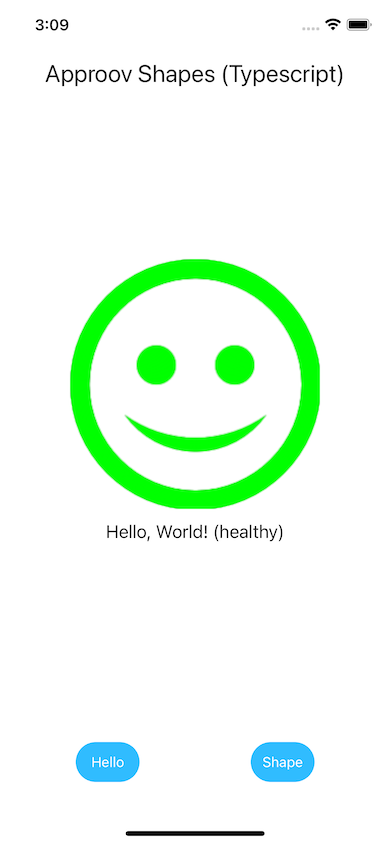
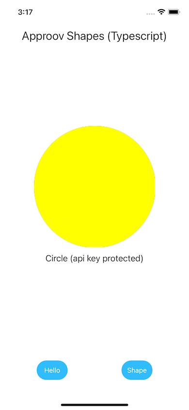
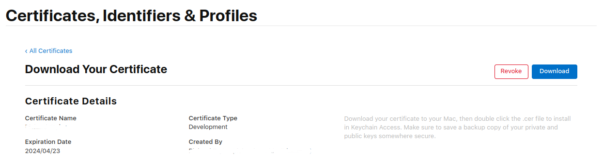
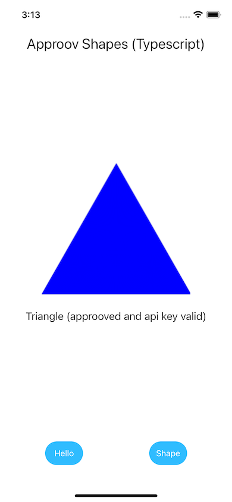

# Shapes Example

This quickstart is written specifically for Android and iOS apps that are implemented using [`NativeScript`](https://docs.nativescript.org/). This quickstart provides a detailed step-by-step example of integrating Approov into an app using a simple `Shapes` example that shows a geometric shape based on a request to an API backend that can be protected with Approov.

## WHAT YOU WILL NEED
* Access to a trial or paid Approov account
* [`NativeScript`](https://docs.nativescript.org/), version 8.4.1 is used in this guide. Follow the instructions to [setup your system](https://docs.nativescript.org/environment-setup.html) as NativeScript has various dependencies on which it relies. Note that when installing Python 2.x on a modern MacOS machine, install Python 2.7 directly and do not follow the advice on using a symbolic link to the Python3 installation, as this seems to lead to complaints from `xcode-select` and the Xcode command line tools.
* [Android Studio](https://developer.android.com/studio) installed (version Hedgehog 2023.1.1 is used in this guide) if you will build the Android app. Note that the `ANDROID_HOME` value must be properly defined to allow building.
* [Xcode](https://developer.apple.com/xcode/) installed (version 15.1 is used in this guide) to build iOS version of application
* [Cocoapods](https://cocoapods.org) installed to support iOS building (1.12.1 used in this guide)
* The `approov` command line tool [installed](https://approov.io/docs/latest/approov-installation/) with access to your account
* An iOS device or simulator if you are using the iOS platform
* An Android device or emulator if you are using the Android platform
* The content of this repo

## RUNNING THE SHAPES APP WITHOUT APPROOV

A number of different variants of the shapes app are provided, namely `demo-typescript`, `demo-axios`, `demo-vue` and `demo-angular`, showing the use of different app flavours and underlying networking stacks. This run through will use `demo-typescript`, but it is possible to go through the steps using any of these different variants. Just be aware that the filenames and location of Approov specific commented out code may be different for the other variants.

Firstly, clone this repo and change directory:

```
cd quickstart-nativescript/demo-typescript
```

You can then run on either Android or iOS as follows:

### Android

If you wish to run on a physical Android device then connect it to your host platform over USB. See [Run apps on a hardware device](https://developer.android.com/studio/run/device) for full instructions. Use `adb devices` to verify that this device is connected and no other device or emulator is running.

Firstly you need to prepare the Android build with:

```
ns prepare android
```

and then you can run the app on your device or emulator with:

```
ns run android
```

### iOS

Firstly you need to prepare the iOS build with:

```
ns prepare ios
```

and then you can run the app on your device or simulator with:

```
ns run ios
```

Note that if running on a device, NativeScript should detect the Team ID necessary for signing. See [iOS Devices](https://docs.nativescript.org/development-workflow.html#ios-devices) for information on how to initially setup app signing.

### Android and iOS

You should see an Approov Shapes app running. This is a plain NativeScript app written in Typescript and Approov is not installed.

<p>
    
</p>

There are two buttons on the app. Pressing `Hello` will call the `shapes.approov.io` server's unprotected connectivity check endpoint `/v1/hello`, and this should succeed:

<p>
    
</p>

The `Shape` button requests a random shape from the API key protected `/v1/shapes` endpoint. This should succeed and you should see a successful shapes call with this (or another shape):

<p>
    
</p>

This endpoint is protected with an API key that is built into the code, and therefore can be easily extracted from the app. The subsequent steps of this guide show you how to provide better protection, either using an Approov Token or by migrating the API key to become an Approov managed secret.

## ADD THE APPROOV PLUGIN

In a shell terminal in the `demo-typescript` directory, type the following command to install the Approov plugin:

```
ns plugin add @approov/nativescript-approov
```

## ENSURE THE SHAPES API IS ADDED

In order for Approov tokens to be generated or secrets managed for the shapes endpoint, it is necessary to inform Approov about it. Execute the following command:

```
approov api -add shapes.approov.io
```

Note that any Approov tokens for this domain will be automatically signed with the specific secret for this domain, rather than the normal one for your account.

## MODIFY THE APP TO USE APPROOV

Uncomment the marked lines in the `app/main-page.ts` file:

```Typescript
import { ApproovService } from '@approov/nativescript-approov';
ApproovService.initialize("<enter-your-config-string-here>");
```

The Approov SDK needs a configuration string to identify the account associated with the app. It will have been provided in the Approov onboarding email (it will be something like `#123456#K/XPlLtfcwnWkzv99Wj5VmAxo4CrU267J1KlQyoz8Qo=`). Copy this to replace the text `<enter-your-config-string-here>`.

You should also change the Shapes endpoint the app is using by changing the marked line:

```Typescript
const VERSION = 'v3';
```

## ADD YOUR SIGNING CERTIFICATE TO APPROOV
You should add the signing certificate used to sign apps so that Approov can recognize your app as being official.

### Android
Add the local certificate used to sign apps in Android Studio. The following assumes it is in PKCS12 format:

```
approov appsigncert -add ~/.android/debug.keystore -storePassword android -autoReg
```

See [Android App Signing Certificates](https://approov.io/docs/latest/approov-usage-documentation/#android-app-signing-certificates) if your keystore format is not recognized or if you have any issues adding the certificate.

### iOS
These are available in your Apple development account portal. Go to the initial screen showing program resources:


Click on `Certificates` and you will be presented with the full list of development and distribution certificates for the account. Click on the certificate being used to sign applications from your particular Xcode installation and you will be presented with the following dialog:



Now click on the `Download` button and a file with a `.cer` extension is downloaded, e.g. `development.cer`. Add it to Approov with:

```
approov appsigncert -add development.cer -autoReg
```

If it is not possible to download the correct certificate from the portal then it is also possible to [add app signing certificates from the app](https://approov.io/docs/latest/approov-usage-documentation/#adding-apple-app-signing-certificates-from-app).

> **IMPORTANT:** Apps built to run on the iOS simulator are not code signed and thus auto-registration does not work for them. In this case you can consider [forcing a device ID to pass](https://approov.io/docs/latest/approov-usage-documentation/#forcing-a-device-id-to-pass) to get a valid attestation.

## SHAPES APP WITH APPROOV API PROTECTION

Run the app again with either `ns run android` or `ns run ios`. Now press the `Shape` button. You should now see this (or another shape):

<p>
    
</p>

This means that the app is obtaining a validly signed Approov token to present to the shapes endpoint.

> **NOTE:** Running the app on an Android emulator or iOS simulator will not provide valid Approov tokens. You will need to ensure it always passes on your the device (see below).

## WHAT IF I DON'T GET SHAPES

If you don't get a valid shape then there are some things you can try. Remember this may be because the device you are using has some characteristics that cause rejection for the currently set [Security Policy](https://approov.io/docs/latest/approov-usage-documentation/#security-policies) on your account:

 Ensure that the version of the app you are running is signed with the correct certificate.
* On Android, look at the [`logcat`](https://developer.android.com/studio/command-line/logcat) output from the device. You can see the specific Approov output using `adb logcat | grep ApproovService`. This will show lines including the loggable form of any tokens obtained by the app. You can easily [check](https://approov.io/docs/latest/approov-usage-documentation/#loggable-tokens) the validity and find out any reason for a failure.
* On iOS, look at the console output from the device using the [Console](https://support.apple.com/en-gb/guide/console/welcome/mac) app from MacOS. This provides console output for a connected simulator or physical device. Select the device and search for `ApproovService` to obtain specific logging related to Approov. This will show lines including the loggable form of any tokens obtained by the app. You can easily [check](https://approov.io/docs/latest/approov-usage-documentation/#loggable-tokens) the validity and find out any reason for a failure.
* Use `approov metrics` to see [Live Metrics](https://approov.io/docs/latest/approov-usage-documentation/#metrics-graphs) of the cause of failure.
* You can use a debugger or emulator/simulator and get valid Approov tokens on a specific device by ensuring you are [forcing a device ID to pass](https://approov.io/docs/latest/approov-usage-documentation/#forcing-a-device-id-to-pass). As a shortcut, you can use the `latest` as discussed so that the `device ID` doesn't need to be extracted from the logs or an Approov token.
* Also, you can use a debugger or Android emulator and get valid Approov tokens on any device if you [mark the signing certificate as being for development](https://approov.io/docs/latest/approov-usage-documentation/#development-app-signing-certificates).

## SHAPES APP WITH SECRETS PROTECTION

This section provides an illustration of an alternative option for Approov protection if you are not able to modify the backend to add an Approov Token check.

Firstly, revert any previous change to `VERSION` in `app/main-page.ts` so that it is:

```Typescript
const VERSION = 'v1';
```

The `API_KEY` should also be changed to be defined as `shapes_api_key_placeholder`, removing the actual API key out of the code.

We need to inform Approov that it needs to substitute the placeholder value for the real API key on the `Api-Key` header. Find this line within the file and uncomment it:

```Typescript
ApproovService.addSubstitutionHeader("Api-Key", "");
```

You must inform Approov that it should map `shapes_api_key_placeholder` to `yXClypapWNHIifHUWmBIyPFAm` (the actual API key) in requests as follows:

```
approov secstrings -addKey shapes_api_key_placeholder -predefinedValue yXClypapWNHIifHUWmBIyPFAm
```

> Note that this command requires an [admin role](https://approov.io/docs/latest/approov-usage-documentation/#account-access-roles).

Run the app again and press the `Shape` button. You should now see this (or another shape):

<p>
    
</p>

This means that the app is able to access the API key, even though it is no longer embedded in the app code, and provide it to the shapes request.
